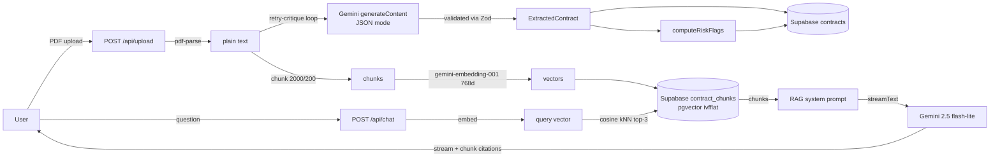

# ContractLens

**Live demo:** [contractlens-gamma.vercel.app](https://contractlens-gamma.vercel.app) · **Walkthrough:** _Loom link coming_ · **Eval report:** [/evals](https://contractlens-gamma.vercel.app/evals)

AI-powered contract intelligence for lease agreements. Upload a PDF, and the app extracts a validated structured summary, flags risk conditions, and lets you chat with the document through a retrieval-grounded chatbot that cites its sources.

Built as a portfolio project to exercise a realistic production-quality LLM pipeline: retry-critique JSON extraction, pgvector RAG with citations, and an eval suite scoring accuracy per field.

## Features

- **Structured extraction** — parties, dates, money, rent escalation, notice period, termination conditions, auto-renewal, governing law, confidence, ambiguities. Every field validated against a Zod schema.
- **Retry-critique loop** — on schema validation failure, the model is called again with field-targeted error feedback. Up to 3 attempts; every attempt is logged.
- **Risk flags** — rule-based layer that turns extracted data into RED / YELLOW / GREEN warnings (auto-renewal deadline closing, empty termination clauses, high escalation, low confidence).
- **RAG chat with citations** — question answering grounded on the top-3 pgvector-retrieved chunks, streamed via the Vercel AI SDK. Assistant messages surface the exact source chunks with similarity scores.
- **Eval suite** — 5 hand-curated lease fixtures scored per-field (strict equality for scalars/dates, Levenshtein similarity ≥ 0.85 for strings, greedy set-F1 for arrays). Report renders at `/evals`.

## Stack

Next.js 14 (App Router, TS strict) · Tailwind + shadcn/ui · Supabase Postgres + pgvector · Gemini (`gemini-2.5-flash-lite` + `gemini-embedding-001`) · pdf-parse v2 · Zod · Vercel AI SDK

## Architecture



## Where I diverged from the spec

Three substitutions during the build; each one called out in code comments at the swap site.

**`gemini-2.0-flash-exp` → `gemini-2.5-flash-lite`.** The -exp preview line was retired; `2.0-flash` is gated to paid quota on new projects (429 with `free_tier_requests limit: 0`); `2.5-flash` was returning 503 "high demand" on free-tier calls. `-lite` is the reliable free-tier surface with the same JSON mode and system-instruction support. One constant to change when capacity stabilises.

**`text-embedding-004` → `gemini-embedding-001` at `outputDimensionality: 768`.** `text-embedding-004` isn't available on the current API key. `gemini-embedding-001` defaults to 3072 dims, but the pgvector column is `vector(768)` (sized for ivfflat index budget and for parity with 004). Passing `outputDimensionality: 768` produces a dimensionally-identical vector — same column, no schema migration.

**`pdf-parse v2` → `unpdf`.** `pdf-parse` transitively depends on `pdfjs-dist`, which references `DOMMatrix`, `ImageData`, `Path2D`, and `@napi-rs/canvas` at module-load time. None of those exist in Vercel's Node serverless runtime, so imports crash before any text is extracted. `unpdf` is a serverless-friendly fork of pdfjs that runs on Vercel/Cloudflare Workers without DOM polyfills. Same text output, clean deploy.

## Engineering decisions

**Single source of truth for the schema.** `lib/schema.ts` exports both the Zod validator and the JSON-shape description that's dropped into the system prompt. The retry loop uses `formatZodIssues()` to tell the model exactly which paths failed and why — it can't drift from the validator because the validator authored the feedback.

**Retry-critique, not retry-same.** Transport-level failures fail fast. Schema failures trigger a second call that includes the previous (invalid) response verbatim plus field-scoped error messages. The model edits its own output instead of rerolling. This is how the pipeline recovers from near-misses like wrong-type nulls or missing required fields without wasting tokens on a full re-extraction.

**Chunking for legal text.** 2000 chars (~500 tokens) with 200-char overlap. A clause that straddles a boundary appears in full in at least one neighbour. Dense enough to embed cheaply, loose enough that retrieval doesn't miss distributed clauses.

**Embedding dimensionality.** `gemini-embedding-001` defaults to 3072 dims, but the pgvector column is `vector(768)` (for ivfflat index budget and because `text-embedding-004` was 768). We pass `outputDimensionality: 768` on every embed call — same model, same column, no schema migration.

**pgvector via RPC.** PostgREST can't invoke the `<=>` cosine operator directly, so similarity search is wrapped in a `match_contract_chunks(query_embedding, match_contract_id, match_count)` SQL function. The Next route just calls the RPC.

**Eval report is pre-computed.** `/evals` renders a cached `evals/report.json` written by `npx tsx evals/run.ts`. Five Gemini calls per page view would blow the free-tier daily quota in two refreshes and take 30+ seconds. The runner is the only thing that talks to the model; the page just reads the file.

**Accuracy scoring is tolerant where it should be, strict where it shouldn't.** Dates, numbers, currency, enums, and booleans require exact equality. Strings use Levenshtein similarity ≥ 0.85 (tolerates casing, whitespace, `Premises` vs `premises`). Termination-condition arrays use greedy bipartite F1 — every expected clause must fuzzy-match an unclaimed actual clause and vice versa. `extraction_confidence` and `ambiguities` are model self-reports and are deliberately excluded from scoring.

## Eval results

Latest run over 5 fixtures (`npx tsx evals/run.ts`):

| Sample                          | Attempts     | Overall    |
| ------------------------------- | ------------ | ---------- |
| 01-residential-india (INR)      | 1            | **92.9%**  |
| 02-commercial-usd               | 1            | **100%**   |
| 03-short-term-no-renewal (AUD)  | 1            | **100%**   |
| 04-high-ambiguity               | 3 (failed)   | —          |
| 05-minimal-fields (EUR)         | —            | quota-limited\* |

**Per-field accuracy** (across samples where extraction succeeded):

| Field                                               | Accuracy |
| --------------------------------------------------- | -------- |
| parties.landlord / tenant / guarantor               | 100%     |
| dates.start_date / end_date / renewal_notice_deadline | 100%   |
| financial_terms.monthly_rent / security_deposit / rent_escalation | 100% |
| notice_period_days                                  | 100%     |
| termination_conditions                              | 100%     |
| auto_renewal.enabled / terms                        | 100%     |
| governing_law                                       | 67% (short strings are fuzzy-match-fragile) |

The high-ambiguity fixture is a genuine pipeline failure: when given a contract full of placeholders and hedged language, Gemini produces a nested-nulls object (`{amount: null, currency: null}`) where the schema expects either a full money object or plain `null`. The retry loop flags the exact fields but the model keeps reproducing the same shape. This is honest signal about where the pipeline falls down on hostile input. Leaving it in the report.

\* Sample 05 hit the `gemini-2.5-flash-lite` free-tier 20-req/day quota during a re-run. It passed cleanly on earlier runs.

## Local setup

### 1. Supabase

Create a new project, enable the `vector` extension, and run this SQL:

```sql
create extension if not exists vector;

create table contracts (
  id uuid primary key default gen_random_uuid(),
  filename text not null,
  uploaded_at timestamptz not null default now(),
  extracted_data jsonb not null,
  risk_flags jsonb not null
);

create table contract_chunks (
  id uuid primary key default gen_random_uuid(),
  contract_id uuid not null references contracts(id) on delete cascade,
  chunk_index int not null,
  content text not null,
  embedding vector(768) not null
);

create index on contract_chunks (contract_id);
create index on contract_chunks using ivfflat (embedding vector_cosine_ops) with (lists = 100);

create function match_contract_chunks (
  query_embedding vector(768),
  match_contract_id uuid,
  match_count int default 3
)
returns table (id uuid, chunk_index int, content text, similarity float)
language sql stable
as $$
  select
    c.id, c.chunk_index, c.content,
    1 - (c.embedding <=> query_embedding) as similarity
  from contract_chunks c
  where c.contract_id = match_contract_id
  order by c.embedding <=> query_embedding
  limit match_count;
$$;
```

### 2. Environment

Copy `.env.example` → `.env.local` and fill in:

```
NEXT_PUBLIC_SUPABASE_URL=
NEXT_PUBLIC_SUPABASE_ANON_KEY=
SUPABASE_SERVICE_ROLE_KEY=
GEMINI_API_KEY=
```

Get a Gemini API key at [aistudio.google.com/apikey](https://aistudio.google.com/apikey).

### 3. Run

```bash
npm install
npm run dev      # http://localhost:3000
```

### 4. Run evals

```bash
npx tsx evals/run.ts
```

Writes `evals/report.json`, which the `/evals` page renders.

## Project layout

```
app/
  api/upload/     multipart PDF → extract → store → background embed
  api/chat/       RAG streaming endpoint
  api/evals/      serves cached report.json
  contract/[id]/  detail page with extracted data + chat
  evals/          accuracy report UI
lib/
  schema.ts       Zod + prompt JSON shape + formatZodIssues
  gemini.ts       retry-critique extraction loop
  embeddings.ts   chunking + embedText + searchChunks
  risk-flags.ts   rule-based risk layer
  pdf.ts          pdf-parse v2 wrapper
  supabase.ts     server-only client
evals/
  compare.ts      Levenshtein, date, set-F1 comparators
  run.ts          runner → report.json
  samples/        5 .txt fixtures
  expected/       5 ground-truth JSONs
```

## Stretch goals / future work

- **Wrap transport errors in exponential backoff.** Today, a 503 from Gemini aborts the whole request. The retry-critique loop only handles schema failures.
- **Fix the ambiguity-case extraction.** Inject a few-shot example of the correct "no deposit" → `null` behaviour into the system prompt, or preprocess the model's output to collapse nested-nulls before Zod sees them.
- **Rerank retrieved chunks.** Top-3 cosine is fine for short contracts but thin on multi-section leases — a cross-encoder rerank over top-10 would help.
- **Stream the extraction too.** Render fields as they arrive instead of waiting for the full JSON. Nice UX; requires switching to a streaming JSON parser.
- **Upload history scoped to users.** Currently the service-role key sees everything. Add Supabase Auth + RLS for multi-user.
